# North · Онлайн-банк

Особистий фінансовий кабінет українською: рахунки, картки, перекази, історія операцій, накопичення та кредитні заявки. Інтерфейс адаптується до комп’ютера й телефона. Валюта — **гривня (UAH, ₴)**.

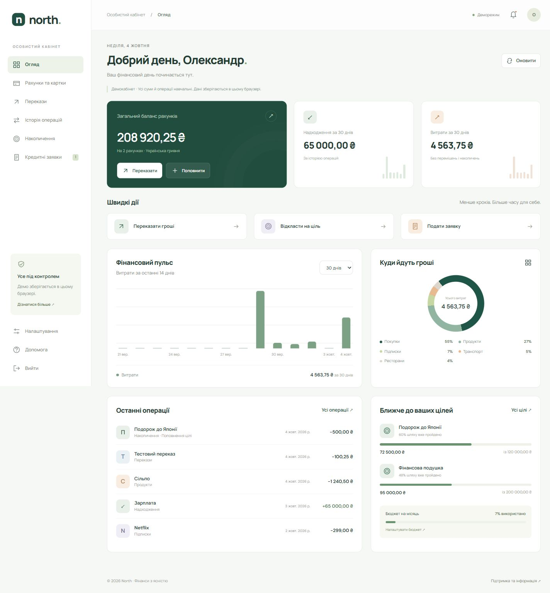

## Можливості

- Огляд балансу, надходжень і витрат за 7, 30 або 90 днів, розподіл витрат за категоріями та графік останніх 14 днів.
- Відкриття облікових рахунків, картки, заморожування та розморожування.
- Перекази отримувачу або між власними рахунками: перевірка суми й залишку, підтвердження та записи в історії.
- Пошук операцій, фільтри за рахунком, категорією, напрямком і датами, пагінація та CSV-експорт відфільтрованих даних.
- Цілі накопичення: створення, прогрес і поповнення зі списанням із рахунку.
- Кредитні заявки: створення, редагування, видалення з підтвердженням, пошук, статуси та імпорт попередніх заявок.
- Профіль, місячний бюджет, JSON-резервна копія, сповіщення про заявки та центр допомоги.
- Вхід, реєстрація, відновлення пароля через Firebase Authentication, автоматичне оновлення токенів і вихід.
- Доступні підписи полів, клавіатурна навігація, модальні вікна з утриманням фокуса, повідомлення про помилки й порожні стани.

Це кабінет для обліку й демонстрації банківських сценаріїв. Він не здійснює платежі через банківську мережу; картки й їхні номери ілюстративні. Для справжніх платежів потрібні серверний фінансовий реєстр, інтеграція з платіжним провайдером, серверна авторизація операцій та аудит.

## Запуск

Потрібен **Node.js 22.12+** або сумісна новіша LTS-версія та **pnpm 12.9.1**. Версія менеджера зафіксована в `packageManager`; npm-lockfile видалено.

```sh
corepack enable
corepack prepare pnpm@12.9.1 --activate
pnpm install --frozen-lockfile
pnpm dev
```

Відкрийте адресу, яку показує Vite (зазвичай `http://localhost:5173`), і натисніть **«Відкрити демокабінет»**. Firebase для цього не потрібен.

```sh
pnpm check         # ESLint + тести + TypeScript + production-збірка
pnpm typecheck     # сувора перевірка типів .ts та .vue
pnpm test          # фінансові сценарії, Firebase REST і збереження
pnpm build         # збірка в dist/
pnpm preview       # локальний перегляд production-збірки
pnpm format        # форматування джерел
pnpm format:check  # перевірка форматування
```

## Демогроші

Початкові дані демокабінету:

| Рахунок / ціль      |                        Сума |
| ------------------- | --------------------------: |
| На щодень           |                 84 520,50 ₴ |
| Резервний рахунок   |                125 000,00 ₴ |
| **Баланс рахунків** |            **209 520,50 ₴** |
| Подорож до Японії   | 72 000,00 ₴ із 120 000,00 ₴ |
| Фінансова подушка   | 95 000,00 ₴ із 200 000,00 ₴ |
| Місячний бюджет     |                 25 000,00 ₴ |

Накопичення враховуються окремо від балансу рахунків. Є зразки зарплати, покупок, підписок і кредитної заявки. Кнопка **«Поповнити»** додає демогроші та створює запис в історії. Поповнення доступне лише в деморежимі.

Зміни зберігаються в `localStorage` під ключем `north-demo-v2`. Сесія деморежиму відновлюється після перезавантаження вкладки. Для повернення до початкових сум видаліть цей ключ у сховищі браузера та перезавантажте сторінку. Це видалить лише локальні демодані. Демогроші ніколи автоматично не потрапляють у профілі Firebase.

## Firebase: збереження всіх даних

1. Відновлений проєкт `vue-online-bank-414c1` підключено за замовчуванням: вхід і реєстрація доступні також на Vercel без додаткових змінних оточення. Для іншого Firebase-проєкту скопіюйте `.env.example` у `.env.local` та замініть публічні параметри. Змінні оточення мають пріоритет над конфігурацією за замовчуванням.
2. У Firebase Authentication увімкніть провайдер **Email/Password**.
3. У Realtime Database налаштуйте доступ за правилами з `firebase.rules.json`. Файл правил підготовлений у репозиторії, але автоматично в хмару не завантажується.
4. Перезапустіть Vite після зміни змінних оточення.
5. Зареєструйтесь або увійдіть зі своїм email та паролем. Створіть перший рахунок або збережіть налаштування — зміни будуть записані в базу.

```dotenv
VITE_FIREBASE_API_KEY=your-public-firebase-api-key
VITE_FIREBASE_DATABASE_URL=https://your-project-default-rtdb.firebaseio.com
```

Профіль, бюджет, рахунки, стани карток, перекази, історія, цілі та кредитні заявки зберігаються разом за адресою:

```text
/users/{firebaseAuthUid}/bank
```

Правила дозволяють читати й змінювати цю гілку лише її авторизованому власнику. Паролі обробляє Firebase Authentication; застосунок їх не зберігає. Токени поточної сесії зберігаються в `sessionStorage`, очищуються після виходу та оновлюються перед запитами.

Перед зміною застосунок читає актуальні дані й ETag. Умовний `PUT` з `If-Match` зберігає баланс і пов’язані записи історії однією операцією. Конфлікт з іншою вкладкою зупиняє збереження; натисніть «Оновити» та повторіть дію. Інтерфейс показує успіх тільки після підтвердженого збереження. Помилки доступу, мережі або локального сховища не змінюють показаний баланс. Ідентифікатори операцій захищають перекази й поповнення від повторного проведення при повторній спробі.

Усі грошові значення в базі — цілі **копійки**, у формах — гривні. Нові профілі Firebase порожні та не отримують вигаданих залишків. Дані перевіряються під час завантаження; порожні масиви, які Firebase видаляє, відновлюються автоматично.

Облікові залишки в цій версії змінює клієнтський застосунок. Правила ізолюють дані користувачів, але не замінюють серверний контроль справжніх банківських коштів. Повне збереження стану підходить для цього кабінету; великі реєстри операцій потребуватимуть серверної пагінації та іншої моделі записів.

### Перенесення попередніх заявок

Стара колекція `/requests` не видаляється. У розділі «Кредитні заявки» доступна кнопка **«Імпортувати з Firebase /requests»**. Вона переносить записи у ваш профіль, переводить старі суми з гривень у копійки та використовує стабільні ID без дублікатів. Старий URL `/request/:id` також перенаправляє до відповідного редактора заявки.

Імпорт потребує наявного дозволу на читання старої колекції. Нові правила за замовчуванням не відкривають `/requests`. Якщо стара колекція містить дані різних людей, перенесення повинен виконати власник проєкту з правильною прив’язкою записів до користувачів. Не відкривайте стару колекцію публічно заради імпорту.

### Розгортання

`firebase.json` містить налаштування Firebase Hosting для каталогу `dist` і перенаправлення SPA-маршрутів на `index.html`. Після налаштування свого Firebase-проєкту та Firebase CLI:

```sh
pnpm build
firebase deploy --only hosting,database --project YOUR_PROJECT_ID
```

Застосуйте правила свідомо: вони замінять поточні правила бази. Для іншого хостингу також потрібне перенаправлення всіх маршрутів на `index.html`. Локальна інтеграція використовує REST API Firebase без серверних секретів і без додаткового Firebase SDK.

## Стек і міграція

| Компонент           | Версія / зміна                  |
| ------------------- | ------------------------------- |
| Vue та compiler-sfc | 3.5.43                          |
| Vite                | 8.3.2 замість Vue CLI / Webpack |
| Pinia               | 4.0.3 замість Vuex              |
| Vue Router          | 5.3.1                           |
| TypeScript          | 6.0.3, strict                   |
| vue-tsc             | 3.3.12                          |
| pnpm                | 12.9.1, зафіксований lockfile   |
| Vitest              | 5.0.3                           |
| ESLint              | 10.12.0, flat config            |
| Prettier            | 3.9.9                           |

Версії перевірені за офіційним npm registry 4 жовтня 2026 року. TypeScript 7.0.2 перевірений, але несумісний із поточними vue-tsc та typescript-eslint; зафіксовано актуальну сумісну гілку 6.0.3. Застарілі Vue CLI, Babel, Vuex, axios, core-js, vee-validate та yup прибрані; запити використовують `fetch`, форми — HTML-обмеження та доменну валідацію.

- `src/domain.ts` — типи, суми в копійках, перевірка даних і фінансові операції.
- `src/firebase.ts` — Authentication REST, оновлення сесії, читання та умовне збереження в Realtime Database.
- `src/store.ts` — Pinia, деморежим і підтверджене збереження.
- `src/router.ts` — маршрути та сумісність старих адрес.
- `src/views/BankView.vue` — екрани кабінету та форми.
- `src/components/` — доступні діалоги, іконки та список операцій.
- `src/theme.css` — адаптивний інтерфейс.

## Перевірки

Автоматичні тести перевіряють округлення до копійок, некоректні суми, недостатній баланс, заморожені картки, збереження сукупного балансу між рахунками, накопичення, повторне проведення операцій, пошкоджені дані, CSV-екранування, ізоляцію шляху Firebase, ETag-конфлікти, відхилений доступ, оновлення токенів і відсутність змін у балансі після помилок збереження. GitHub Actions запускає `pnpm check` для push і pull request.

У браузері перевірені демопереказ на 100,25 ₴, поповнення цілі на 500 ₴, збереження після перезавантаження, створення та зміна статусу заявки, пошук операцій і компонування на широкому та мобільному екранах. Firebase REST перевірений автоматичними тестами з підміненою мережею. Живий вхід і запис у ваш Firebase-проєкт потребують ваших облікових даних і застосованих правил; без них хмарний сценарій не перевірений.

## Скриншоти

Усі знімки зроблено з робочого застосунку з українським інтерфейсом і демоданими. Частина знімків відображає стан після перевірених операцій, тому залишки можуть відрізнятися від початкових.

### Вхід

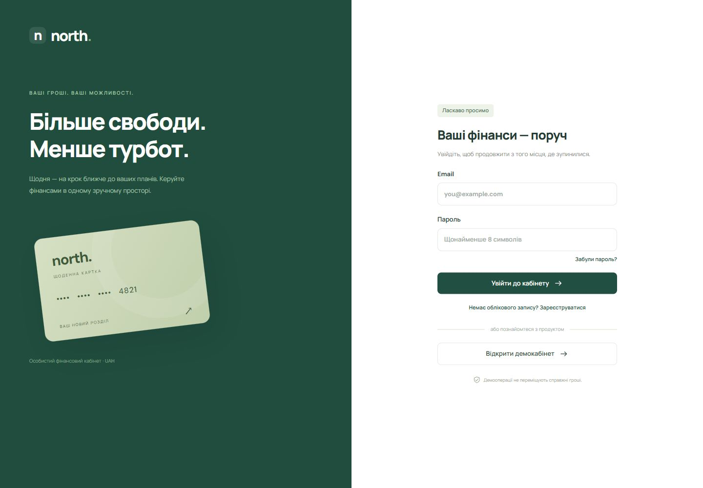

### Рахунки та картки

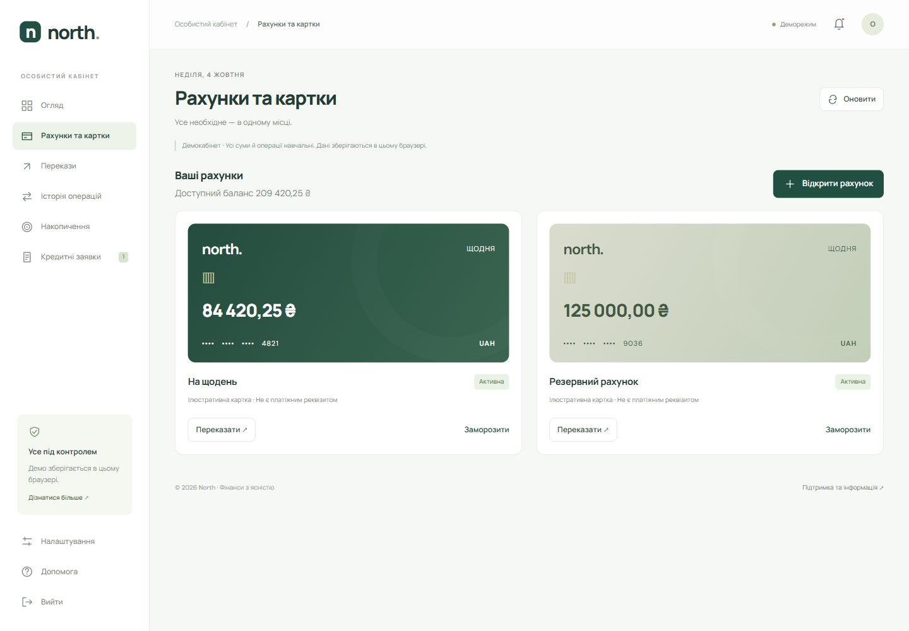

### Підтвердження переказу

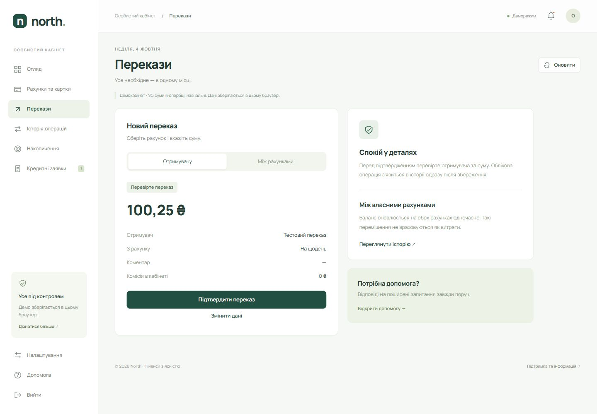

### Історія операцій

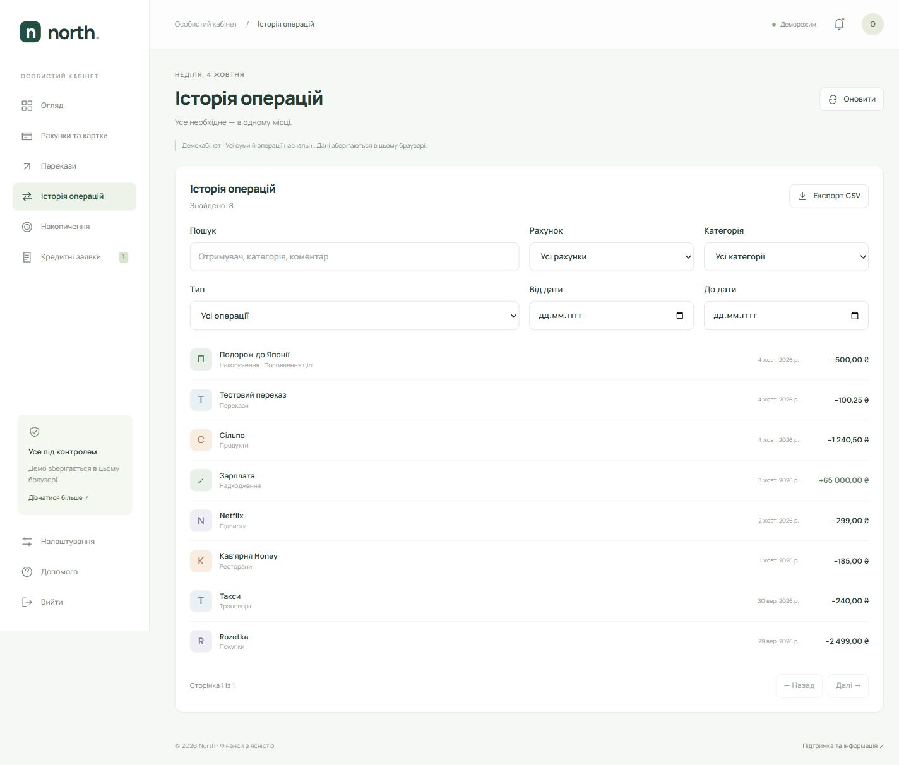

### Накопичення

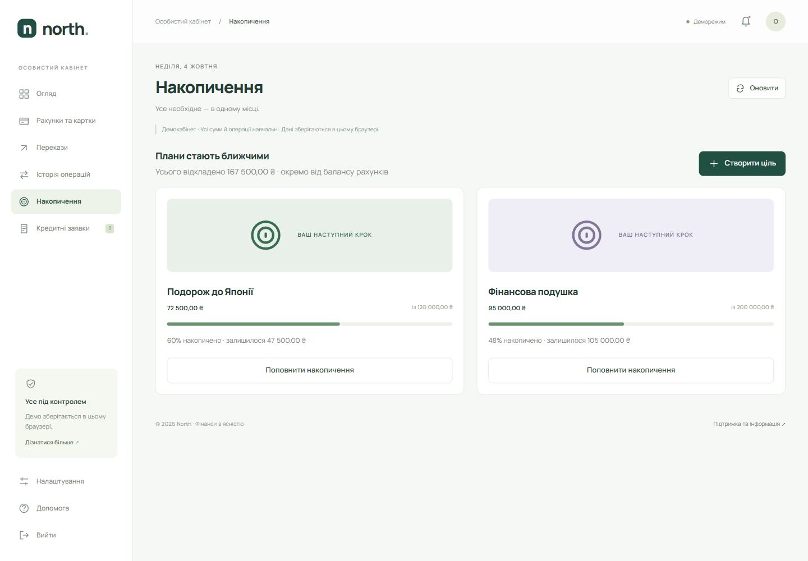

### Кредитні заявки

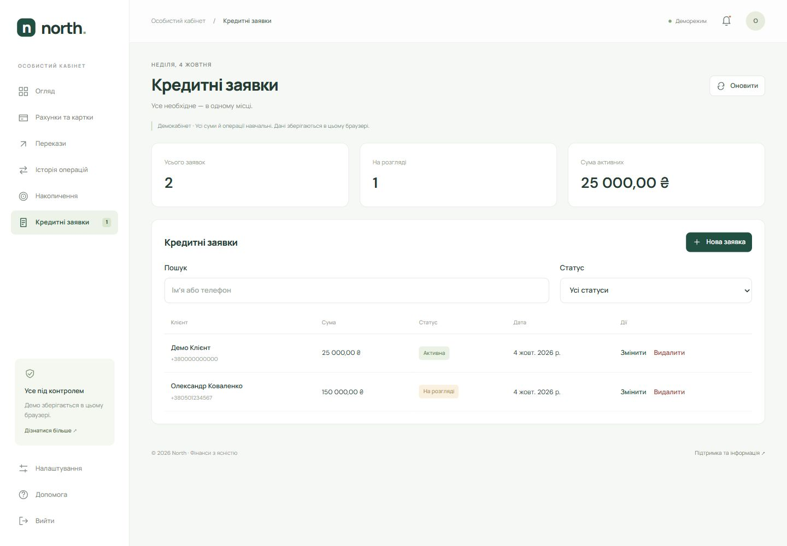

### Створення заявки

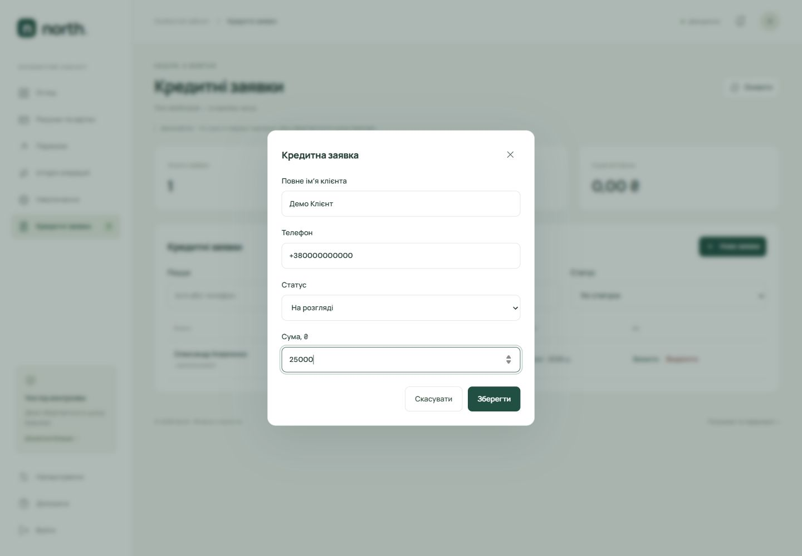

### Профіль і бюджет

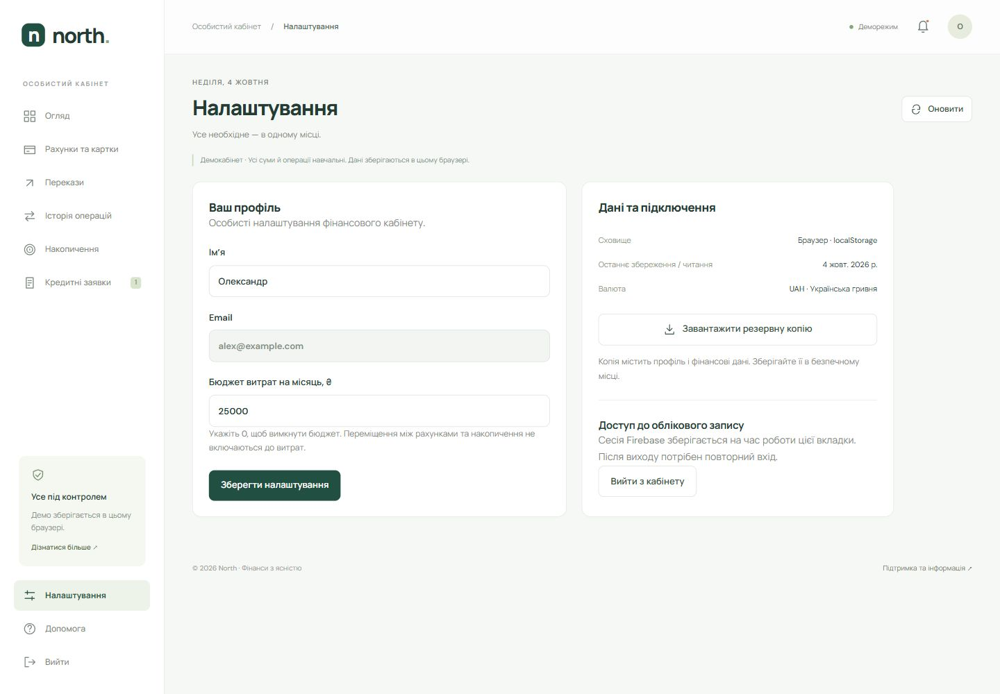

### Допомога

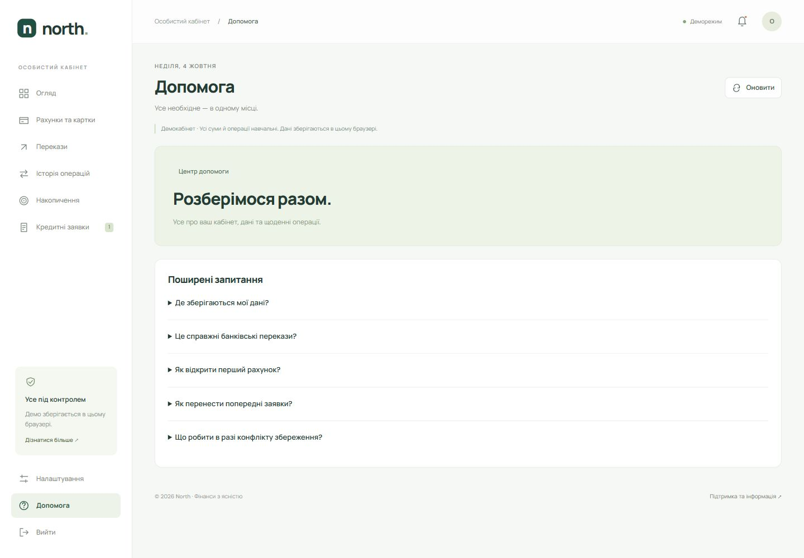

### Мобільна версія

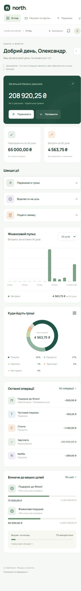
